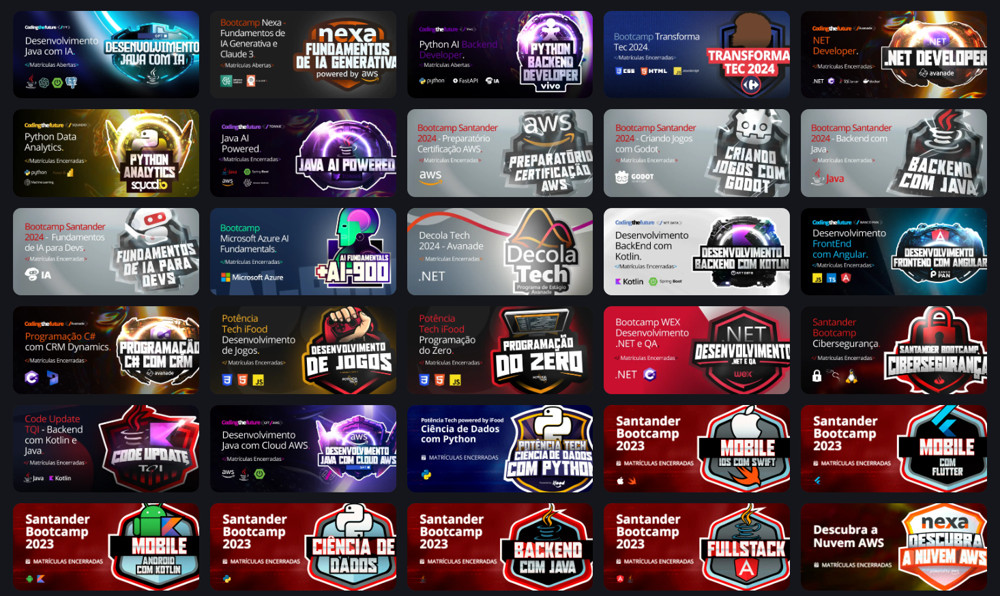

**Bem-vindo ao DIO.me!**

Obrigado pelo seu interesse no DIO.me! Aqui está um guia rápido para começar com nossa plataforma:

### Sobre o DIO.me

O DIO.me é uma plataforma de aprendizado online projetada para ajudar você a aprimorar suas habilidades e conhecimentos em diversas áreas. Seja você um iniciante ou esteja buscando aprimorar sua expertise, o DIO.me oferece uma variedade de recursos para apoiar sua jornada de aprendizado.

### Recursos do Plano Gratuito do DIO.me

* **Um Bootcamp Gratuito por Mês** : Como membro do nosso plano gratuito, você pode participar de um bootcamp por mês sem custo.
* **Cursos e Tutoriais** : Acesse uma ampla gama de cursos e tutoriais sobre diferentes temas.
* **Suporte da Comunidade** : Engaje-se com uma comunidade vibrante de aprendizes e especialistas.

### Como Começar

1. **Cadastre-se** : Visite [DIO.me](https://www.dio.me/sign-up?ref=KGCZDJNZQN) e cadastre-se no nosso plano gratuito.
2. **Explore** : Navegue pelos bootcamps, cursos e tutoriais disponíveis.
3. **Participe de um Bootcamp** : Escolha um bootcamp que lhe interesse e comece a aprender!
4. **Conecte-se** : Junte-se aos nossos fóruns comunitários para se conectar com outros aprendizes e compartilhar insights.

### Por que Escolher o DIO.me?

O DIO.me está comprometido em oferecer experiências de aprendizado acessíveis e valiosas. Seja para desenvolver novas habilidades para sua carreira ou explorar interesses pessoais, nossa plataforma oferece os recursos necessários para o seu sucesso.

### Inicie sua Jornada de Aprendizado Hoje!

Visite [DIO.me](https://www.dio.me/sign-up?ref=KGCZDJNZQN) agora para explorar nossas ofertas gratuitas e embarcar em uma jornada de aprendizado contínuo. Aprimore suas habilidades, expanda seu conhecimento e junte-se a uma comunidade apaixonada pela educação.

Por favor, observe: O plano gratuito permite a participação em um bootcamp por mês.

Bons estudos!
