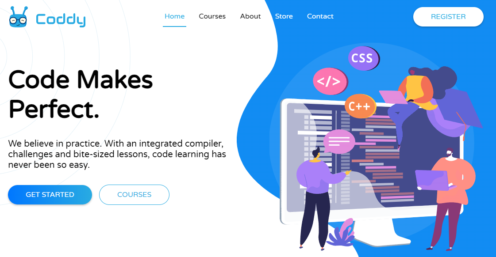

O [Coddy.tech](https://coddy.tech/?ref=rejIga) é uma plataforma educacional que funciona de forma semelhante ao Duolingo, mas focada em programação. Ele oferece uma experiência interativa e gamificada para aprender diversas linguagens e tecnologias. A plataforma possui uma parte gratuita que já é suficiente para começar a aprender e melhorar suas habilidades de programação.

Convidamos você a se inscrever e explorar os recursos gratuitos disponíveis. Comece sua jornada de aprendizado de programação de forma divertida e eficaz com Coddy.tech.

